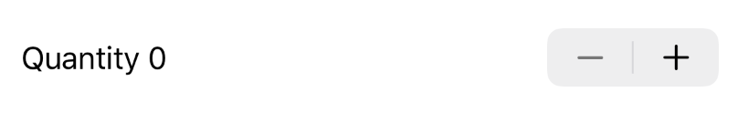
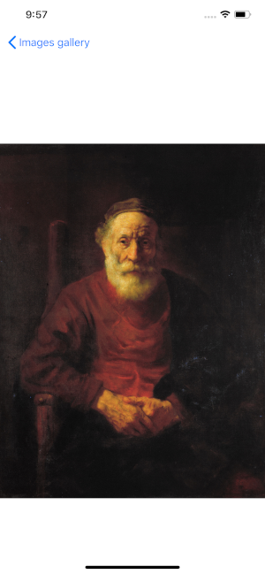

# swiftui-guide

## Components

### Simple text field
```swift
struct ContentView: View {
    var body: some View {
        Text("Hello world")
            .italic()
            .font(.title)
            .lineLimit(1)
            .padding()
            .frame(maxWidth: .infinity, alignment: .center)
            .multilineTextAlignment(.center)
    }
}
```

### TextField
Simple TextField with rounded border
```swift 
TextField("Text placeholder", text: $text)
                .textFieldStyle(RoundedBorderTextFieldStyle())
```

TextField with custom border
```swift
TextField("Text placeholder", text: $text)
    .background(
        RoundedRectangle(cornerRadius: 30)
            .strokeBorder(Color.blue, lineWidth: 5))
```

### SecureField
Secured input
```swift 
SecureField("Enter password", text: $password)
```

### TextView
If you need multiline text input you have to use UITextView from UIKit
```swift
struct TextView: UIViewRepresentable {
    @Binding var text: String
    var font:UIFont? = UIFont(name: "HelveticaNeue", size: 15)
    var background:UIColor? = nil

    func makeCoordinator() -> Coordinator {
        Coordinator(self)
    }

    func makeUIView(context: Context) -> UITextView {
        let textView = UITextView()
        textView.delegate = context.coordinator
        if let font=self.font {
            textView.font = font
        }
        if let background = self.background {
            textView.backgroundColor = background
        }
        return textView
    }

    func updateUIView(_ uiView: UITextView, context: Context) {
        uiView.text = text
    }

    class Coordinator : NSObject, UITextViewDelegate {
        var parent: TextView
        
        init(_ uiTextView: TextView) {
            self.parent = uiTextView
        }

        func textView(_ textView: UITextView, shouldChangeTextIn range: NSRange, replacementText text: String) -> Bool {
            return true
        }

        func textViewDidChange(_ textView: UITextView) {
            self.parent.text = textView.text
        }
    }
}
```

After that you can use it
```swift
struct ContentView: View {
    @State var text:String = ""
    var body: some View {
        TextView(text: $text, background: UIColor.red)
    }
}
```


### Image
System image fits and fills frame region


```swift
Image(systemName: "cloud.sun.fill")
    .resizable()
    .aspectRatio(contentMode: .fill)
    .foregroundColor(.red)
    .frame(width: 300, height: 300, alignment: .center)
    .border(Color.black,width: 5)
```

Filled and clipped image


```swift 
Image(systemName: "cloud.sun.fill")
    .resizable()
    .aspectRatio(contentMode: .fill)
    .foregroundColor(.red)
    .frame(width: 300, height: 300, alignment: .center)
    .border(Color.black,width: 5)
    .clipped()
```

Image from assets with round clipped with white corner and shadow


```swift 
Image("SalvadorDali")
    .resizable()
    .aspectRatio(contentMode: .fill)
    .frame(width: 300, height: 300, alignment: .center)
    .clipShape(Circle())
    .overlay(Circle().stroke(Color.white, lineWidth: 5))
    .shadow(radius: 10)
```

For add zoom to image use `MagnificationGesture` gesture and `scaleEffect` metod

```swift
struct ContentView: View {
    @State var scale: CGFloat = 1.0
    var body: some View {
        Image("SalvadorDali")
            .resizable()
            .scaledToFit()
            .scaleEffect(scale)
            .gesture(
                MagnificationGesture()
                    .onChanged { val in
                        self.scale = val
                }
                .onEnded { val in
                    self.scale = 1.0
                }
        )
    }
}
```

### Button

Simple counter exmaple with Text and Button components
```swift
struct ContentView: View {
    @State var counter:Int = 0
    var body: some View {
        VStack {
            Text("Clicked \(counter) times")
                .font(.title)
            Button(action:{
                self.counter += 1
            }){
                Text ("Click")
            }.padding()
        }
    }
}
```

Button with background color and round corners


```swift
Button(action:{
    self.counter += 1
}){
    Text("OK")
        .foregroundColor(Color.white)
}
.frame(width: 100)
.padding()
.background(Color.blue)
.cornerRadius(10)
```

FloatingActionButton


```swift
Button(action:{
    self.counter += 1
}){
    Image(systemName: "plus")
        .foregroundColor(Color.white)
}
.padding(20)
.background(Color.blue)
.clipShape(Circle())
```

### Toggle


```swift
struct ContentView: View {
    @State var status:Bool = true
    var body: some View {
        VStack {
            Toggle(isOn: $status) {
                Text ("Switch status")
            }
        }
    }
}
```

### Picker

Static picker values


```swift
struct ContentView: View {
    @State var index = 0
    var body: some View {
        Picker(selection: $index, label:Text("Picker"), content: {
                Text("Value 1").tag(0)
                Text("Value 2").tag(1)
                Text("Value 3").tag(2)
                Text("Value 4").tag(3)
        })
    }
}
```

Static from values list

```swift
struct ContentView: View {
    let values:[String] = ["Value 1","Value 2","Value 3","Value 4","Value 5"]
    @State var index = "Value 1"
    var body: some View {
        Picker(selection: $index, label:Text("Picker")){
            ForEach(values, id:\.self) { value in
                Text(value)
            }
        }
        .pickerStyle(WheelPickerStyle())
        .padding()
    }
}
```

To hide label use `.labelsHidden()` and `EmptyView()` in label

```swift
Picker(selection: $index, label: EmptyView()) {
    ForEach(values, id:\.self) { value in
        Text(value)
    }
}.labelsHidden()
```

You can use different styles. Default style is `WheelPickerStyle`, but another styles may be used in `.pickerStyle()`. For iOS only  `WheelPickerStyle` and `SegmentedPickerStyle` are available. 

SegmentedPickerStyle


### DatePicker

`DatePicker` allows to select date in range. the range can be set using dates range.


```swift
struct ContentView: View {
    @State var selectedDate = Date()
    var dateClosedRange: ClosedRange<Date> {
        let min = Calendar.current.date(byAdding: .day, value: -1, to: Date())!
        let max = Calendar.current.date(byAdding: .day, value: 1, to: Date())!
        return min...max
    }
    var body: some View {
        VStack{
            DatePicker(
                selection: $selectedDate,
                in: dateClosedRange,
                displayedComponents: .date,
                label: { Text("Due Date") }
            )
            .padding()
        }
    }
}
```

You can use half-open ranges. To change display formate use `displayedComponents`

```swift
DatePicker("Date",
        selection: $selectedDate,
        in: Date()...,
        displayedComponents: [.hourAndMinute, .date]
    )
```

### Slider

Slider selects values in range. By default range is 0.0...1.0 but you can change  it with `in` and `step` properties


```swift
struct ContentView: View {
    @State var progress = 0.0

    var body: some View {
        VStack {
            Slider(value: $progress, in: 0.0...100.0, step: 20.0)
        }
    }
}
```

### Stepper
Stepper allows increment and decrement value



```swift
struct ContentView: View {
    @State var quantity = 0
    
    var body: some View {
        Stepper("Quantity \(quantity)", value: $quantity, in: 0...10)
    }
}
```

You can use something more complex in label

```swift
struct ContentView: View {
    @State var quantity = 0
    
    var body: some View {
        Stepper(value: $quantity, in: 0...10, label: { HStack{
            Text("Quantity ")
            Text("\(quantity)")
            }
        }).padding()
    }
}
```

God mode is on

```swift
struct ContentView: View {
    @State var quantity = 0
    
    var body: some View {
        Stepper(onIncrement: {
            self.quantity += 1
        }, onDecrement: {
            if self.quantity >= 10 {
                self.quantity -= 10
            }
        }, label: { Text("Quantity \(quantity)") })
    }
}
```

## Layout

### Stacks

Use `VStack`, `HStack` and `ZStack`  to organize components vertically, horizontally or on the Z axis. Use `aligment` and `spacing` to set elements positions in the stack.

```swift
struct ContentView: View {
    var body: some View {
        VStack(alignment: .center) {
            HStack(alignment: .top, spacing: 0) {
                Text("Text 1")
                Text("Text 2")
            }
            Text("Text 3")
            Image(systemName: "cloud.sun.fill")
                .resizable()
                .aspectRatio(contentMode: .fill)
                .foregroundColor(.red)
                .frame(width: 300, height: 300, alignment: .center)
                .border(Color.black,width: 5)
        }
    }
}
```

### Spacer
`Spacer` expands all available space along the major axis of parent stack.

```swift
HStack {
    Text("Hello")
    Spacer()
    Text("world")
}
```

### Divider
UI component which separates UI elements

```swift
VStack {
    Text("Hello")
    Divider()
    Text("world")
}
```

### Group
Groups UI components

```swift
Group {
    Text("Hello world")
    Image(systemName: "cloud.sun.fill")
}
```
### List

List of elements arranged in a single column

```swift
List {
    Text("Item 1")
    Button(action:{}) {
            Text ("Item 2")
        }.padding()
}
```
`List` from range


```swift
List (1..<20) { index in
    Text("Item \(index)")
}
```

`List` from strings list

```swift
struct ContentView: View {
    let list = ["1", "2", "3"]
    var body: some View {
        List(list) { item in
            Text(item)
        }
    }
}
```

To use complex objects you need to set some field as `id`


```swift
struct Icon {
    let id = UUID()
    var name:String
}

struct ContentView: View {
    let icons = [
        Icon(name: "cloud.sun.fill"),
        Icon(name: "cloud.sun.rain.fill"),
        Icon(name: "cloud.sun.bolt.fill")
    ]
    var body: some View {
        List(icons, id:\.id) { icon in
            HStack {
                Image(systemName: icon.name)
                Text(icon.name)
            }
        }
    }
}
```

### ForEach
Use `ForEach` to create list of views in a loop. It seems `List` but may be used more flexibly.


```swift
struct Icon {
    let id = UUID()
    var name:String
}

struct ContentView: View {
    let icons = [
        Icon(name: "cloud.sun.fill"),
        Icon(name: "cloud.sun.rain.fill"),
        Icon(name: "cloud.sun.bolt.fill")
    ]
    var body: some View {
        VStack {
            ForEach(icons, id:\.id) { icon in
                HStack {
                    Image(systemName: icon.name)
                    Text(icon.name)
                }
                .frame(maxWidth: .infinity, alignment: .center)
            }
        }
    }
}
```

## ScrollView

Scrollable view


```swift
var body: some View {
        ScrollView {
            VStack {
                ForEach(1..<50){ index in
                    Text("\(index)")
                        .padding()
                        .frame(width: 100, height: 50, alignment: .center)
                        .border(Color.black,width: 5)
                }
            }
            ScrollView(.horizontal, showsIndicators: false) {
                HStack {
                    ForEach(1..<50){ index in
                        Text("\(index)")
                            .padding()
                            .frame(width: 80, height: 80, alignment: .center)
                            .border(Color.black,width: 5)
                    }
                }
            }
        }
    }
```

### Form

Container which groups components for data entry. For example settings, user forms, etc.


```swift
struct ContentView: View {
    @State var email = ""
    @State var address = ""
    
    var body: some View {
        Form {
            Section(header: Text("header").font(.caption), footer: Text("footer").font(.caption)) {
                TextField("email", text:$email)
                TextField("address", text:$address)
            }
        }
    }
}
```

### TabView
Allows switch between views


```swift
struct ContentView: View {
    var body: some View {
        TabView {
            VStack{Image("SalvadorDali")
                .resizable()
                .aspectRatio(contentMode: .fill)
                .frame(width: 300, height: 300, alignment: .center)
                .clipShape(Circle())
                .overlay(Circle().stroke(Color.white, lineWidth: 5))
                .shadow(radius: 10)}
                .tabItem({
                    Image(systemName: "star")
                    Text("First tab")
                })
                .tag(0)
            List(1..<30) { index in
                Text("Item \(index)")
            }
            .tabItem({
                Image(systemName: "star.fill")
                Text("Second tab")
            })
                .tag(0)
        }
    }
}
```

### NavigationView and NavigationLink

Allows represent views stack. To switch View use `NavigationLink` with view as destination. You need to use `.buttonStyle(PlainButtonStyle())` for images and buttons if you don't want to see blue overlay color. To set title use `.navigationBarTitle()`.

     

```swift
struct ImageView:View {
    var image:String
    
    var body: some View {
        Image(image)
            .resizable()
            .scaledToFit()
    }
}

struct ContentView: View {
    private let images = ["image1","image2","image3","image4","image5","image6","image7"]
    var body: some View {
        NavigationView {
            ScrollView {
                VStack{
                    ForEach(images, id:\.self) { image in
                        NavigationLink(destination: ImageView(image: image)) {
                            Image(image)
                                .resizable()
                                .scaledToFill()
                                .frame(width: 300, height: 300, alignment: .center)
                                .clipped()
                        }
                        .buttonStyle(PlainButtonStyle())
                    }
                }
            }.navigationBarTitle("Images gallery")
        }
    }
}
```

If you want to see navigationBarTitle in old style, use `displayMode: .inline`

```swift 
    ScrollView {
        //...
    }.navigationBarTitle("Images gallery", displayMode: .inline)
```